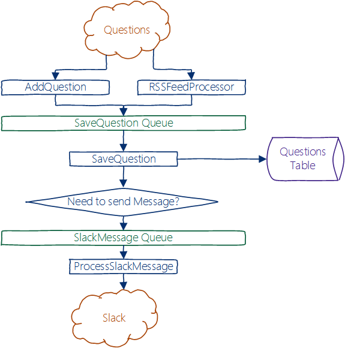

# Feedback Engine

A tool for collecting questions and feedback from various sources, assigning owners, and notifying them and others.

## Why build a new thing?

We needed a better tool for gathering and assigning all the questions we source from the internet (StackOverflow, MSDN, Reddit, Twitter, etc.). Probably a case where we should have looked for a solution out there, but thought it would be a cool thing to build with WebJobs and other Azure products. It's really easy to extend and modify the implementation we went with, so it should work well long term, and with App Service and Storage, maintenance is easy.

## Is this a real service?

Nope, not yet, really. I'll be iterating on this for my team to meet some requirements, and might make it more and more easy to use in the future, including making this Readme more useful and less like a blog. If you want to contribute, feel free to send me a PR.

If you want to learn more about how this (WebJobs/Storage) stuff works, message me on twitter: [@crandycodes](https://twitter.com/crandycodes) and I'll do my best to help out.

## How does it work?

The notion is that we need to flow data through the system, with reasonably high reliability (yay Queues!), and it needs to be pretty modular so we can add-on and customize it as we come up with new ideas on how to be better at answering questions and using those customer questions drive product decisions.

Currently, we have a layer which is grabbing questions from a Webhook endpoint (so we can use things like Logic Apps and IFTTT to send questions our way) and also an RSS Feed Processor which grabs questions from an RSS feed every so many minutes and pipes them into the `SaveQuestion` Queue.

It's a key point that the Queue can have many types and varieties of producers, but we only have one flavor of consumer - thus the Queue is named after the consumer WebJob. Or is the WebJob named after the Queue? Definitely a chicken and egg problem. It's possible to have multiple types of consumers (nothing stops this), but it's likely to produce inconsistent behavior in your app if you don't know what you're doing, so recommend following the pattern I'm using here.

We then check if the content is fresh and "upsert" (if dne, insert, else update) into our `Questions` table in Azure Table Storage. This means if there are updates or whatever to the question as they pop in our RSS feed, we'll update the question as well. This could create a lot of noise in the SaveQuestion Queue if there are lots of less meaningful updates, but it's not a behavior we've seen too much of - most updates are interesting to us.

Finally, we toss it into the `SlackMessage` queue. Then the `ProcessSlackMessage` function <small>(I know, that naming convention isn't consistent; do as I say, not as I do)</small> grabs the message off the Queue and posts it to Slack via in Inbound Webhook set up with Slack.

This design pattern is really simple to understand and is extensible. The real questions to ask are "should I do these two thigns in a WebJob or should I make a Queue for it". I've tried to keep to follow the thought process that each layer should have simlar functional inputs and outputs and should produce and consume a single type of Object. If you're creating several new POCOs in a single function, you may need to slice things up.

Why does it matter? It'll all get done anyway, yeah? Eh, yeah. But by chopping it up into smaller chunks, it decreases the odds we lose a lot of work due to a crash in the WebJob. Murphy's law spares no one and you should assume that it will crash and often. That's not a reflection of WebJobs or App Service, which offer pretty solid SLAs, but just a reality of building highly scalable/available/reliable applications; plan for the worst and you won't be surprised when it happens. This also helps if you ever need to split each function into a separate WebJob and App Service plan. Right now, all these are in the same App (and thus on the same Plan), but we could put each layer on a separate App Service plan and scale that plan based on the Queue length.

## Deployment Instructions

Download/clone the repository and open the FeedbackEngine solution with Visual Studio. If you set up your Storage Account settings and other various App Settings, it should be good to go and run locally. The RSS feed scanner should work fine locally, and the WebHook can be pinged locally if you don't want to wait for new stuff to flow through. You need to setup a Slack account and an inbound webhook for the slack posting to work.

To deploy to Azure, create an Azure Web App, make sure you have your settings all set up there as well, and then right click on the WebJob and click Publish as Azure Webjob, select continuous, and hit deploy. You can then send Webhook requests to your `*.scm.azurewebsites.net` site and watch the process flow via the WebJobs dashboard.

## License

[MIT](./LICENSE)
